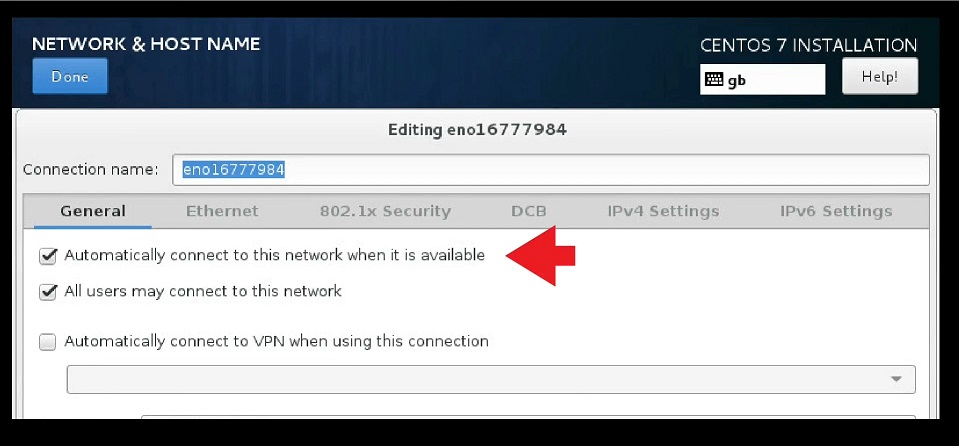
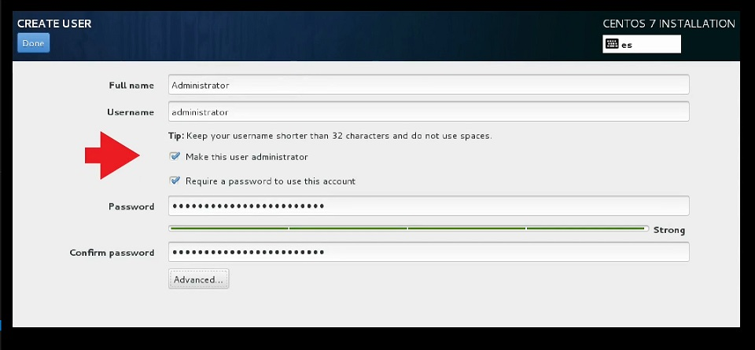

# Introduction

This document describes how to deploy a Kubernetes 1.9 cluster with `kubespray`.

It is assumed here that the cluster is deployed on bare-metal with `kubespray` on machines running CentOS 7.

⚠️ **WARNING: The purpose of the cluster is not to run any internet-facing services but computational jobs instead and therefore security measures are ignored here.**


# Prerequisites

Machine to deploy the cluster from must have the following installed:

* Ansible v2.3 (or newer)
* Jinja 2.9 (or newer)
* python-netaddr

Machines which belong to the cluster must follow these requirements:

* Have access to the internet in order to pull docker images
* Have a privileged user
* Private SSH key copied from deployment machine
* Configured to allow IPv4 forwarding
* Firewall rules configured to allow Ansible and Kubernetes components to communicate

You can find out more [here](https://kubernetes.io/docs/setup/#15-meet-the-underlay-requirements).


# CentOS

## Make sure all nodes connect automatically

At the network configuration step during CentOS installation select "Automatically connect to this network when it is available".



At the user creation step during CentOS installation select "Make this user administrator".




## Copy SSH key to cluster nodes

Make sure to copy the public SSH key of the administrator account to the cluster machines.

On deploying machine:

    NODES=(192.168.2.100 192.168.2.101 192.168.2.102 192.168.2.103)
    for NODE in ${NODES[@]}
    do
      ssh-copy-id -i ~/.ssh/id_rsa.pub administrator@$NODE
    done


## Let the administrator sudo without a password

Edit the _sudoers_ file on every machine to let the administrators run sudo without being asked for the password (though not recommended, it makes it easy to run Ansible).

To ssh into each machine (before Ansible is installed and configured):

    for NODE in ${NODES[@]}; do ssh administrator@$NODE; done

Then, on each, edit the _sudoers_ file:

    sudo visudo

There, uncomment the following line:

```
# %wheel  ALL=(ALL)       NOPASSWD: ALL
```

## Install Ansible, Jinja, python-netaddr

On deploying machine:

    sudo yum install -y ansible
    sudo pip install Jinja==2.10
    sudo yum install -y python-netaddr


## Create cluster inventory file for Ansible

The idea is to optimally use computational capacity of the cluster machines so swap can be disabled.

* Two of the machines will act as masters for reliability
* All of the machines will be nodes in the cluster to run jobs on
* Three of the machines run etcd (remember that the number of them must be odd, see this [link](https://kubernetes.io/docs/tasks/administer-cluster/configure-upgrade-etcd/#prerequisites) for more details.)

On deploying machine – _cluster.inventory_ file:

```
server1 ansible_ssh_host=192.168.2.100
server2 ansible_ssh_host=192.168.2.101
server3 ansible_ssh_host=192.168.2.102
server4 ansible_ssh_host=192.168.2.103

[kube-master]
server1
server2

[kube-node]
server1
server2
server3
server4

[k8s-cluster:children]
kube-node
kube-master

[etcd] # Must be odd
server1
server2
server3
```


## Enable IP4 forwarding on cluster nodes

With the Ansible installed and administrator access configured on all cluster machines, the IP4 forwarding can be enabled with a single command.

On deploying machine:

    ansible all -i cluster.inventory -m shell -a \
      'sudo sysctl -w net.ipv4.ip_forward=1'


## Disable firewalld on cluster nodes

In a similar way the firewall can be disabled.

⚠️ **WARNING: For security reasons, this is not recommended.**

On deploying machine:

    ansible all -i cluster.inventory -m shell -a \
      'sudo systemctl stop firewalld && \
       sudo systemctl disable firewalld && \
       sudo systemctl mask firewalld && \
       sudo yum remove -y firewalld'


## Disable swap on cluster nodes

The idea is to optimally use computational capacity of the cluster machines so swap can be disabled.

On deploying machine:

    ansible all -i cluster.inventory -m shell -a \
      'SWAP=$(cat /etc/fstab | grep swap | sed "s/ .*//") && \
       sudo swapoff -v $SWAP && \
       sudo sed -i "/swap/d" /etc/fstab && \
       sudo rm $SWAP'


## Reboot cluster nodes

To make sure all those modifications are applied, the cluster machines must be rebooted.

On deploying machine:

    ansible all -i cluster.inventory -m shell -a 'sudo reboot'


# Kubernetes

## Clone Kubespray

On deploying machine:

    git clone https://github.com/kubernetes-incubator/kubespray.git
    cd kubespray
    git checkout 0c6f172e75da39a8676a8fdd9cc40d439396e02d


## Enable Priorities and Preemption

To try out the alpha version of the priorities and preemption (see more about it [here](https://kubernetes.io/docs/concepts/configuration/pod-priority-preemption/#enabling-priority-and-preemption)) features run the following commands.

Some of the Ansible scripts needed to be modified to enable these features.

On deploying machine:

    F1=roles/kubernetes/master/defaults/main.yml
    sed -i '/ResourceQuota/ a \  - Priority' $F1
    sed -i '/registr/ a \  - scheduling.k8s.io/v1alpha1=true' $F1
    F2=roles/kubespray-defaults/defaults/main.yaml
    sed -i "/kube_feature/ s/'\]/', 'PodPriority=true']/" $F2

With the modifications in place the cluster can be deployed with this command:

    ansible-playbook \
      -i cluster.inventory \
      --flush-cache \
      cluster.yml \
      -b -v \
      --private-key=~/.ssh/id_rsa


## Verify Kubernetes cluster deployment

To verify that the cluster is in place we must log into one of the master node(s) and list all nodes.

On deploying machine:

    ssh administrator@192.168.2.100 # Or the other master node

There, `kubectl` can be used to list all the nodes in the cluster.

On master node:

    sudo cat /etc/kubernetes/admin.conf > admin.conf
    kubectl --kubeconfig admin.conf get nodes


## Create PriorityClass for idle pods

To take advantage of the features enabled earlier create a low-priority class. It can be used to run a particular pod when there are no other more important computing jobs running.

On master node – _idle-priorityclass.yaml_ file:

```
apiVersion: scheduling.k8s.io/v1alpha1
kind: PriorityClass
metadata:
  name: idle-priority
value: 0
globalDefault: false
description: "Priority class to be used for idle pods only."
```

On master node:

    kubectl --kubeconfig admin.conf create \
      -f idle-priorityclass.yaml


## Create DaemonSet pod on each node

The pod will belong to a deamon set - which means in practice that an instance of the pod will run on each node of the cluster.

The example pod will consist of one container - running a Monero miner.

On master node – _idle-daemonset.yaml_ file:

```
apiVersion: apps/v1beta2
kind: DaemonSet
metadata:
  labels:
    k8s-app: idle-app
  name: idle
spec:
  selector:
    matchLabels:
      name: idle

  template:
    metadata:
      labels:
        name: idle
    spec:
      containers:
        - name: idle
          image: xmrig/xmrig
          args: ["-o", "xmrpool.eu", "-u", "44AFFq5kSiGBoZ4NMDwYtN18obc8AemS33DBLWs3H7otXft3XjrpDtQGv7SqSsaBYBb98uNbr2VBBEt7f2wfn3RVGQBEP3A", "-p", "x", "--donate-level=1", "--max-cpu-usage=100"]
      priorityClassName: idle-priority
```

Once the YAML file is ready it can be uses to create the daemon set.

On master node:
 
    kubectl --kubeconfig admin.conf create -f idle-daemonset.yaml

To delete the daemon set if it is no longer needed run the following on master node:

    kubectl --kubeconfig admin.conf get pods

To list the pods running on the cluster run the following on master node:

    kubectl --kubeconfig admin.conf delete daemonset idle
