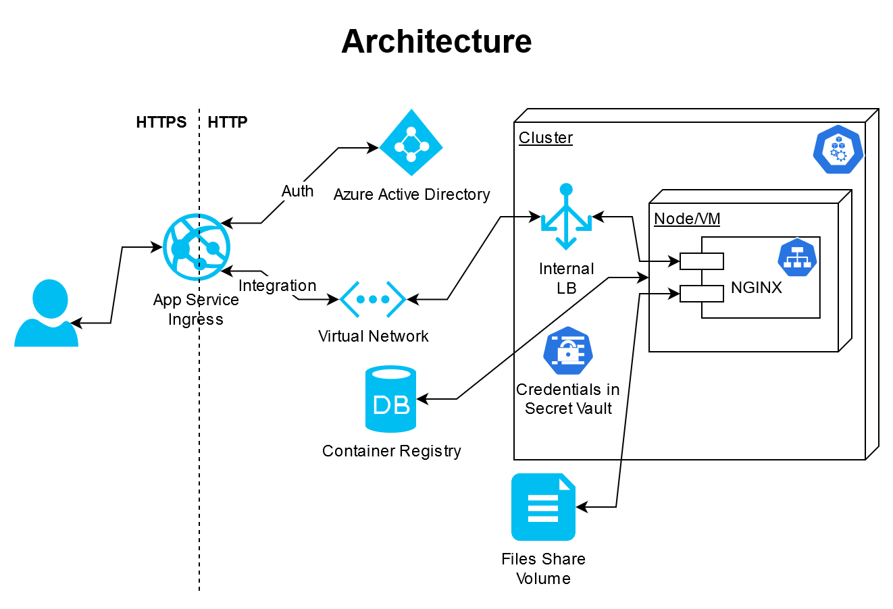

# Kubernetes: AKS with Authenticated App Service Ingress

Scripts in this repository implement a template for provisioning a password protected App Service which proxies (via VNet Integration) to a pod running on Azure Kubernetes Service serving static frontend (without anonymous cluster access) kept on a Files Share (and volume mounted using key kept in Kubernetes secrets vault).

After running the create script the app will be available at:

    https://[PREFIX]app.azurewebsites.net/index.html

# Extras

## Sources & Materials

* [Network concepts for applications in Azure Kubernetes Service (AKS)](https://docs.microsoft.com/en-us/azure/aks/concepts-network)
* [Create an ingress controller in Azure Kubernetes Service (AKS)](https://docs.microsoft.com/en-us/azure/aks/ingress-basic)
* [Integrate your app with an Azure Virtual Network](https://docs.microsoft.com/en-us/azure/app-service/web-sites-integrate-with-vnet)
* [Tutorial: integrate Functions with an Azure virtual network](https://docs.microsoft.com/en-us/azure/azure-functions/functions-create-vnet)
* [Restrict egress traffic for cluster nodes in Azure Kubernetes Service (AKS)](https://docs.microsoft.com/en-us/azure/aks/limit-egress-traffic)

## Kubernetes & Security Automation

* [Microsoft Security Blog: Threat matrix for Kubernetes](https://www.microsoft.com/security/blog/2020/04/02/attack-matrix-kubernetes/)
* [Security risk analysis for Kubernetes resources (kubesec.io)](https://kubesec.io/)
* [Example recipes for Kubernetes Network Policies](https://github.com/ahmetb/kubernetes-network-policy-recipes)
* [Using RBAC Authorization (kubernetes.io)](https://kubernetes.io/docs/reference/access-authn-authz/rbac/)
* [HashiCorp Blog: Injecting Vault Secrets Into Kubernetes Pods via a Sidecar](https://www.hashicorp.com/blog/injecting-vault-secrets-into-kubernetes-pods-via-a-sidecar/)
* [Pod Security Policies (kubernetes.io)](https://kubernetes.io/docs/concepts/policy/pod-security-policy/)
* [Falco: Cloud-Native Runtime Security Threat Detection](https://falco.org/)
* [Audit your Kubernetes clusters against common security controls: kubeaudit](https://github.com/Shopify/kubeaudit)
* [Check whether Kubernetes is deployed according to security best practices as defined in the CIS Kubernetes Benchmark: kube-bench](https://github.com/aquasecurity/kube-bench)
* [DZone Security: Implementing Aqua Security to Secure Kubernetes](https://dzone.com/articles/implementing-aqua-security-to-secure-kubernetes)
* [Advanced Persistence Threats: The Future of Kubernetes Attacks (RSA Conference)](https://www.youtube.com/watch?v=CH7S5rE3j8w)

## Docker & Security Automation

* [AppArmor security profiles for Docker (docker.com)](https://docs.docker.com/engine/security/apparmor/)
* [Security Linter for Docker Images: dockle](https://github.com/goodwithtech/dockle)
* [Docker Bench for Security - checks for common best-practices around deploying Docker containers](https://github.com/docker/docker-bench-security)

## Code & Security Automation

* [GitHub Security Lab: CodeQL](https://securitylab.github.com/tools/codeql)
* [Learning CodeQL](https://help.semmle.com/QL/learn-ql/)
* [The Twelve-Factor App (12factor.net)](https://12factor.net/)
* [SonarQube](https://www.sonarqube.org/)
* [find-sec-bugs](https://find-sec-bugs.github.io/)
* [Open Policy Agent - Declarative Policies](https://www.openpolicyagent.org/)
* [Using Valgrind To Track Down Known And Unknown Bugs In Your Code (Hackaday)](https://hackaday.com/2020/04/29/using-valgrind-to-track-down-known-and-unknown-bugs-in-your-code/)
